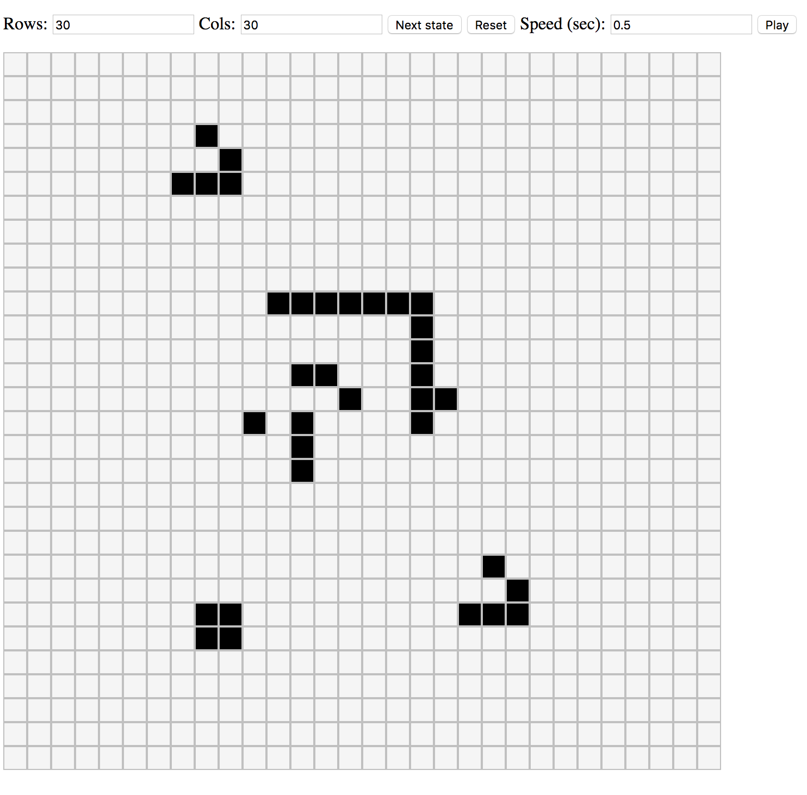

# Conway's Game of Life

_The Game of Life, also known simply as Life, is a cellular automaton devised by
the British mathematician John Horton Conway in 1970._

This project was generated with [Angular
CLI](https://github.com/angular/angular-cli) and **built in 2 hours** end to
end for the purpose of an exercise

## Rules

Cells can be dead (white) or alive (black). Every cell interacts with its eight
neighbours, which are the cells that are horizontally, vertically, or
diagonally adjacent according to the following rules:

* Any live cell with fewer than two live neighbours dies, as if caused by underpopulation.
* Any live cell with two or three live neighbours lives on to the next generation.
* Any live cell with more than three live neighbours dies, as if by overpopulation.
* Any dead cell with exactly three live neighbours becomes a live cell, as if by reproduction.

## Demo

## Improvments

#### Grid 

Notable optimization possible: Use a `Hashmap` to represent only the living
cells within the grid (density of living cells is generally small). This will
reduce the linear N square search each steps.

To avoid recalculating the neighbours each steps, it could be stored witinh the
`HashMap` value.

##### Next step algo

Do not duplicate the grid. Instead just store a `Hashmap` of the cell
difference that should be applied after all rules are executed.

One you iterate over all living cells, also process the neighboor dead cells
(or store them and process at then end to avoid processing them multiple times)

##### Unit-test

Add unit-test at least for the Redux reducer which is the core logic.

## Getting Started

* Install [Angular CLI](https://github.com/angular/angular-cli)
* Run `ng serve` for a dev server
* Navigate to `http://localhost:4200/` - The app will automatically reload

## Build

* Run `ng build` to build the project
* The build artifacts will be stored in the `dist/` directory. 
* Use the `-prod` flag for a production build.
